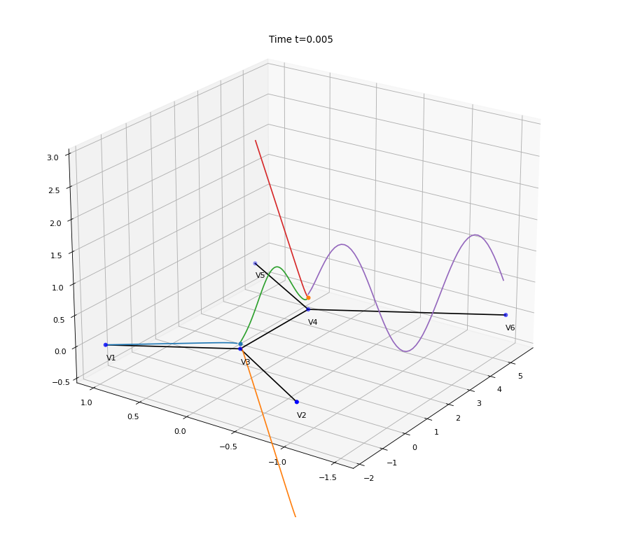

## Finite difference scheme for convection-diffusion initial-boundary value problem on metric trees

### The problem 

The file `numerical_graph.py` implements the numerical solution of the following system on the metric tree $\Gamma$, having the set of vertices $V$ and the set of edges $E$:

$$\begin{cases}
\partial_t u_e(t,x) -\delta \partial_{xx} u_e(t,x)+\alpha_e\partial_x u_e(t,x) =0 , & x \in e\in E, t\geq 0;\\
u_{e_1}(t,v) = u_{e_2}(t,v), & v\in V_{\rm int}, e_1,e_2\in E_v,t\geq 0;\\
\sum_{e\in E_v^{\rm in}} \partial_x u(t,v) = \sum_{e\in E_v^{\rm out}} \partial_x u(t,x), & v\in V_{\rm int},t\geq 0;\\
u(0,x)=u_0(x), & x\in \Gamma;\\
u(t,v)=u_v(t), & v\in V_{\partial},t\geq 0.
\end{cases}$$

Here, $V_{\rm int}$ stands for the set of interior vertices, and the set of boundary vertices is denoted by $V_{\partial}$. The set $E_v$ of the edges adjacent to a vertex $v$ is divided into the set of incoming edges $E_v^{\rm in}$ and the set of outgoing edges $E_v^{\rm out}$. The function $u$ defined on the graph is the family of all $(u_e)_{e\in E}$. The diffusivity coefficient $\delta$ is a positive constant and the non-negative speeds $\alpha_e$ corresponding to each edge satisfy, for each interior vertex $v$:

$$\sum_{e\in E_v^{\rm in}} \alpha_e = \sum_{e\in E_v^{\rm out}} \alpha_e.$$

The finite differnece scheme is stable provided that the the time step $\tau$ and the width of the spatial discretisation $h$ satisfy $\tau <\frac{h}{\max_{e\in E}\alpha_e}$.
The convergence of the finite difference scheme is $\mathcal{O}(\tau+h)$ for regular enough initial and boundary data.


### Dependencies

To run the code, you should have a version of Python at least 3.9 and the following libraries installed on your system:
```
numpy
scipy
matplotlib
```


### The plot of the solution

The output of the algorithm consists of an animation of the evolution of the solution:



Copyright © 2023 Dragoș Manea. All rights reserved.

The author wants to thank [COST Action CA18232 - _Mathematical models for interacting dynamics on networks_](https://mat-dyn-net.eu/) for supporting this work.

The author also acknowledges the hospitality of the [Chair for Dynamics, Control, Machine Learning and Numerics](https://dcn.nat.fau.eu/) in the Department of Mathematics, [FAU Erlangen-Nürnberg](https://www.fau.de/), where part of this work was carried out.